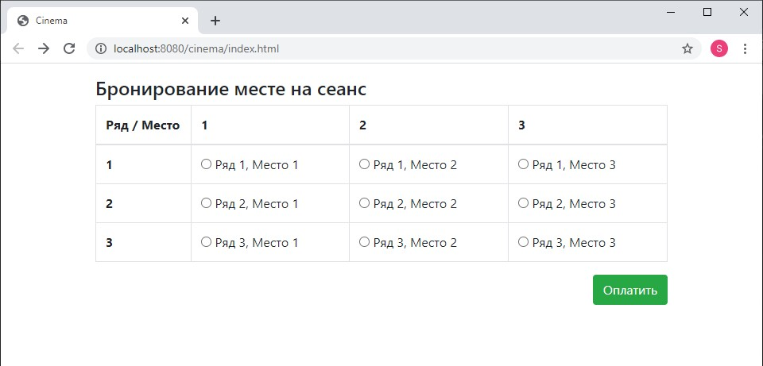
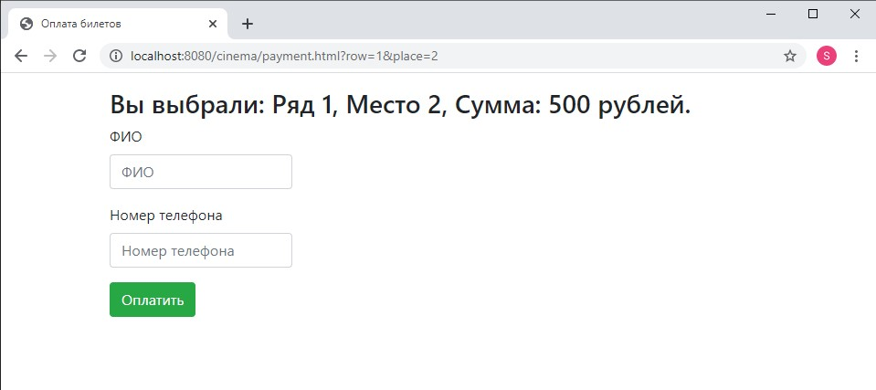
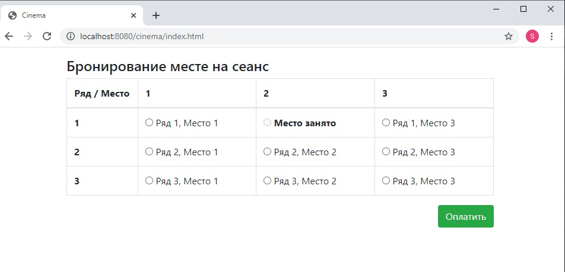

# job4j_cinema

##### Инструменты использованые в проекте:

- ***Servlet***
- ***JavaScript/JQuery***
- ***JDBC/PostgreSQL***
- ***Maven***
- ***Apache Tomcat***
- ***JUnit/Mockito***
- ***JaCoCo***
- ***Travis CI***
- ***Git***

## О проекте.

Учебный проект представляет собой кинотеатр на 12 мест с возможностью покупки билетов.

- Страница зал кинотеатра.

- Страница оплаты билета.

- Страница зала кинотеатра после оплаты билета.

- Страница просмотра кандидатов.

## Контакты.

***email:*** morozov.java.job@gmail.com